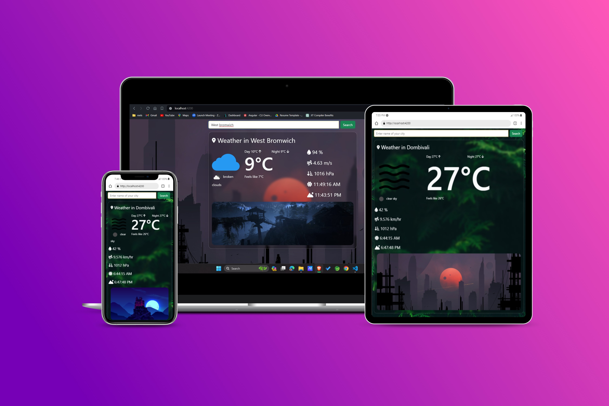

# WeatherApp

WeatherApp is a user-friendly web application that provides real-time weather stats for global locations. Integrated with the OpenWeatherMap API, it ensures accurate and up-to-date weather information, making it easy for users to access the data they need effortlessly.



This project was generated with [Angular CLI](https://github.com/angular/angular-cli) version 17.1.3.

## Development server

Run `ng serve` for a dev server. Navigate to `http://localhost:4200/`. The application will automatically reload if you change any of the source files.

## Code scaffolding

Run `ng generate component component-name` to generate a new component. You can also use `ng generate directive|pipe|service|class|guard|interface|enum|module`.

## Build

Run `ng build` to build the project. The build artifacts will be stored in the `dist/` directory.

## Running unit tests

Run `ng test` to execute the unit tests via [Karma](https://karma-runner.github.io).

## Running end-to-end tests

Run `ng e2e` to execute the end-to-end tests via a platform of your choice. To use this command, you need to first add a package that implements end-to-end testing capabilities.

## Environment Configuration

This project requires an API key from OpenWeatherMap to fetch weather data. Follow these steps to set up the API key:

1. Sign up for an account on [OpenWeatherMap](https://openweathermap.org/).
2. After signing in, navigate to your account dashboard and locate your API key.
3. In the `src/environments` directory, you'll find two environment files: `environment.prod.ts` and `environment.ts`.
4. Open both files and replace `'your_api_key'` with your actual API key obtained from OpenWeatherMap.
5. Ensure that you replace the API key in both `environment.prod.ts` and `environment.ts` files, as one is used for production and the other for development.
6. Save the changes.

Now, your Angular application is configured to use the API key for fetching weather data from OpenWeatherMap.

```typescript
// src/environments/environment.ts

export const environment = {
  production: false,
  openWeatherApiKey: 'your_api_key'
};
